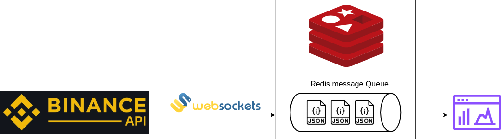

# Bitcoin-Streaming-Redis

# To run :
## with docker
Execute the run.sh script it has everything you need 
```bash
chmod +x run.sh
bash run.sh
```
## Pull from dockerhub
Alternatively you can pull from the dockerhub, and then run the container directly
```bash
docker pull krizalid69/bitcoin-stream-redis:latest
```

## Without docker
You will need to run both of the publisher.py and subscriber.py and then the dash_app.py
First create a venv and install dependencies
```bash
python3 -m venv venv 
. venv/bin/activate
pip install -r requirements
```
then run the necessary files :
```bash
python3 publisher.py 
python3 subscriber.py
python3 dash_app.py
```